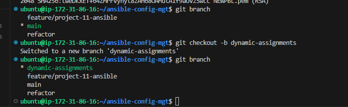
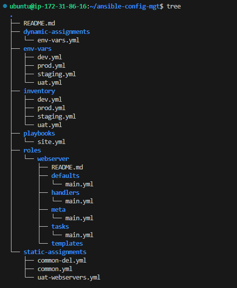
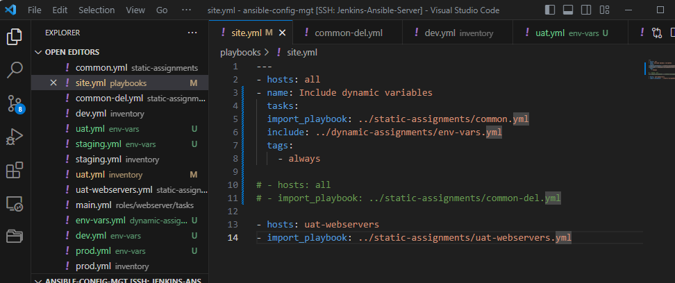
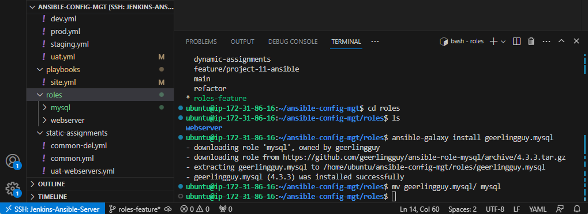
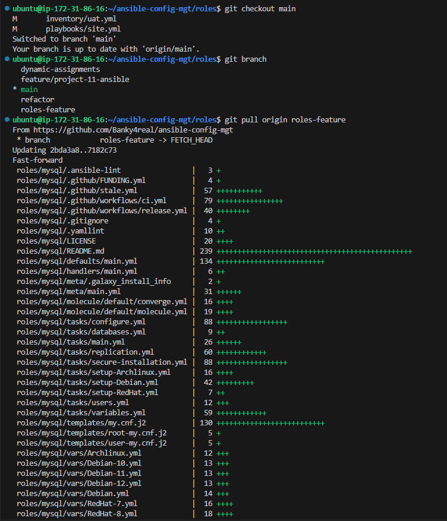
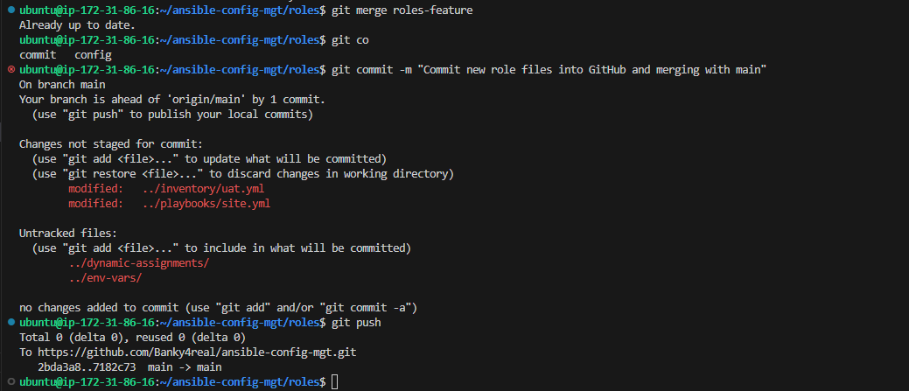
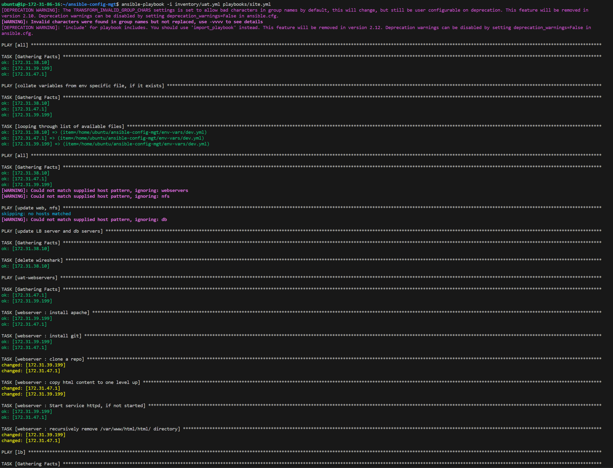

## **Documentation for Project 13**

### Introducing Dynamic Assignment Into Our structure

### Creating another Branch named dynamic-assignments under our ansible-config-mgt repo on github

`git checkout -b dynamic-assignments`

### New Layout

### Updating site.yml with dynamic assignments

### New role created by geerlingguy installed using ansible-galaxy and folder renamed to mysql

`ansible-galaxy install geerlingguy.mysql`
`mv geerlingguy.mysql/ mysql`

### Uploading our changes to github roles-feature branch

`git checkout main`
`git pull origin roles-feature`
`git merge roles-feature`
`git commit -m "Commit new role files into GitHub and merging with main"`
`git push`

### Running our playbook against to configure apache Load Balancer

